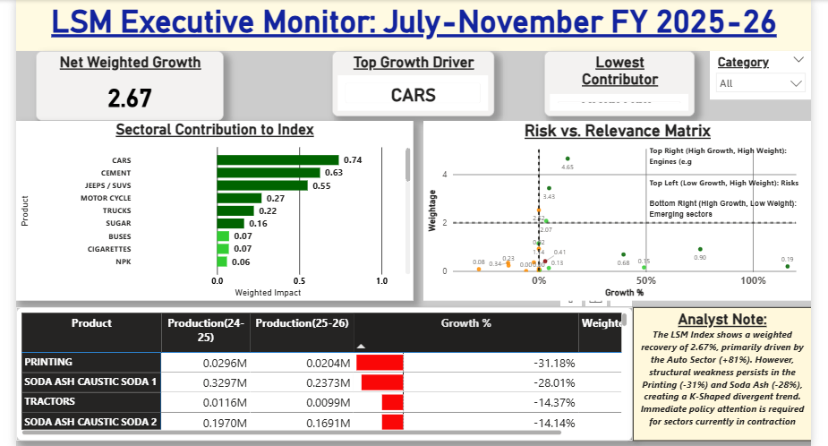
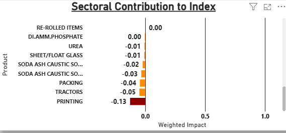
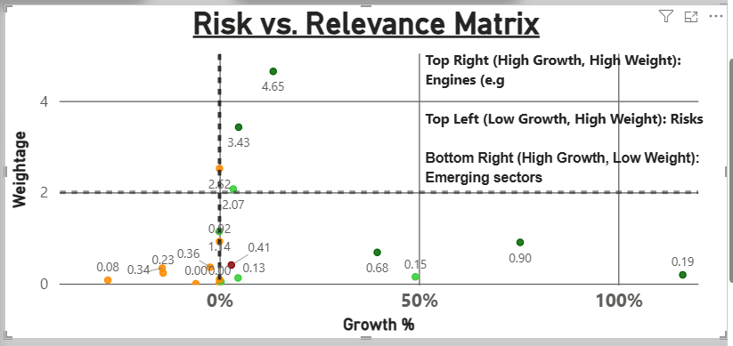
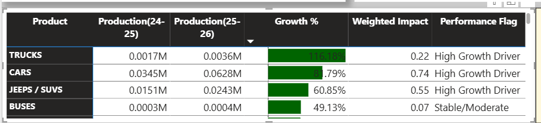

 <br><br>


# Pakistan Large Scale Manufacturing (LSM) Power BI Dashboard  
### July–November, FY 2024–25 & 2025–26  

*A structured analytical Power BI dashboard built for real-world economic monitoring*

---

## 1. Project Overview

This project is a real-world simulation of how industrial performance is monitored at the government level in Pakistan.

I built an interactive **Power BI dashboard** using official [**Large Scale Manufacturing (LSM) July–November, FY 2024–25 & 2025–26 data published by the Federal Ministry of Industries & Production, Pakistan**](https://moip.gov.pk/SiteImage/Misc/files/Growth%20Rate%20of%2031%20LSM%20items%20for%20the%20period%20July-November%2c2025-26.pdf).


At its core, this project answers one key question:

> **Is Pakistan’s industrial sector really recovering — and if yes, who is actually driving it?**

The answer is more nuanced than headline growth numbers suggest.

**[READ THE FULL REPORT (PDF)](/Report.pdf)**
---

## 2. Objectives

This project was built with clear, practical goals:

- Convert raw, messy government data into a clean, scalable analytical model  
- Move beyond misleading “headline growth” to measure **true economic contribution**  
- Design a **single-page dashboard** delivering insights 
- Simulate analytical rigor expected in **public-sector and enterprise analytics roles**  
- Demonstrate readiness for **real-world analytics**

---

## Table of Contents
- [Pakistan Large Scale Manufacturing (LSM) Power BI Dashboard](#pakistan-large-scale-manufacturing-lsm-power-bi-dashboard)
    - [July–November, FY 2024–25 \& 2025–26](#julynovember-fy-202425--202526)
  - [1. Project Overview](#1-project-overview)
  - [2. Objectives](#2-objectives)
  - [3. The Business Problem: Why This Matters](#3-the-business-problem-why-this-matters)
  - [4. Tech Stack](#4-tech-stack)
  - [5. Data Preparation \& Feature Engineering](#5-data-preparation--feature-engineering)
    - [Key Challenges](#key-challenges)
    - [What I Did](#what-i-did)
  - [6. Model](#6-model)
    - [Weighted Impact Model (Final Choice)](#weighted-impact-model)
  - [7. Key Business Insights](#7-key-business-insights)
  - [8. Dashboard Insights](#8-dashboard-insights)
  - [9. Real-World Impact](#9-real-world-impact)
  - [10. How to Run the Project](#10-how-to-run-the-project)
  - [11. Author](#11-author)


---

## 3. The Business Problem: Why This Matters

Industrial data often appears positive while hiding structural risks.

In Pakistan’s LSM data:

- Small industries can show massive growth percentages  
- Large industries can quietly contract  
- Headline numbers can mask sector-level distress  

**Examples:**

- Automobiles may grow by **80%+**  
- Industrial inputs like **steel, paper, and soda ash** may be shrinking  

If decision-makers rely only on unweighted growth rates, they risk:

- Misallocating policy support  
- Missing early warning signs  
- Overestimating economic recovery  

This project answers:

> **Who is growing fast — and who actually matters?**

---

## 4. Tech Stack

- **Power BI** – Dashboard design, data modeling
- **Power Query)** – ETL, cleaning, normalization  
- **DAX (Data Analysis Expressions)** – Custom metrics, weighted logic  
- **Excel** – Raw data inspection and transformation 
- **Python** - Exploratory Data Analysis (EDA) 


---

## 5. Data Preparation & Feature Engineering

Government data is rarely analysis-ready.

### Key Challenges

- Mixed data and pre-calculated totals (risk of double-counting)  
- Null values hiding production shutdowns  
- Non-unique PSIC codes  
- Mixed units (tons, numbers, cases)  
- Inconsistent text values (case, whitespace, hidden characters)  

### What I Did

- Designed a **Star Schema** (Fact + Dimensions)  
- Removed all hard-coded totals   
- Built a **Fiscal Year calendar**  
- Standardized text keys using `TRIM`, `CLEAN`, `UPPER`  
- Replaced nulls with zeros where economically meaningful  
- Removed misleading aggregate production KPIs  

---

## 6. Model

### The Logic: Weighted Impact vs. Simple Growth

Standard growth rates can be misleading. A **50% increase** in a small industry (like *Footballs*) often looks better than a **2% increase** in a massive industry (like *Textiles*), even though the latter contributes more to GDP.

To solve this, I engineered a **Weighted Impact** metric using `SUMX`. This iterates through every industry to calculate its specific contribution before aggregating the total.

**The DAX Formula:**

```dax
Weighted Impact = 
SUMX(
    Dim_Items, 
    [Growth %] * Dim_Items[Weightage]
)
```
---

## 7. Key Business Insights

- Pakistan’s LSM shows a **K-shaped recovery**  
- Auto sector dominates headline growth  
- Industrial inputs are contracting quietly  
- Steel decline despite cement growth signals **supply-chain stress**  
- Printing and paper show persistent negative impact  

This disconnect is what I call:

> **The “Auto Illusion”**

---

## 8. Dashboard Insights

A common failure in government reporting is the creation of a **wall of data** — dense tables with high cognitive load.
This dashboard was engineered as an Executive Monitor, optimized to reduce time-to-insight to just few seconds.


- Displays **Net Weighted Growth Contribution (2.67)** — engineered to avoid aggregating incompatible units  
- Automatically identifies:
  - **Top Growth Driver** (currently: Cars)  
  - **Lowest Contributor**  

- **Visual 1: Winners & Losers (Bar Chart)**
  - Purpose: Expose the K-shaped recovery
  - Design: Sectors sorted strictly by [Weighted Impact]
  - Insight: Automobiles dominate the positive range (green), while Printing, Paper, and Soda Ash anchor the negative tail (red), confirming structural divergence.


  <p align="center">
  
  <br>
  <em>Sectoral contribution revealing K-shaped recovery</em>
</p>

  <p align="center">
  
  <br>
  <em>Sectoral contribution revealing K-shaped recovery</em>
</p>

 <br><br>
- **Visual 2: Risk vs Relevance Matrix**

  - A policy-prioritization scatter plot separating signal from noise
  - Separates high-growth noise from high-impact risk 
    - X-axis: Growth % (Velocity)
    - Y-axis: Official Weightage (Economic Volume)
  - Interpretation:
    - Top-Right: Engines of growth (high weight, high growth)
    - Top-Left: Code Red sectors (high weight, negative growth) — early GDP risk signals even when headline growth appears strong.
    - Center Cluster: The "Stability Backbone" — Sectors with consistent demand. They show modest change because people buy the same amount every year, regardless of economic booms or busts

<p align="center">
    
    <br>
    <em>Risk vs Relevance Matrix </em>
</p>


<br><br>
- **Visual 3: The Audit Matrix**
  - Government-style ledger with columns Production (2024-2025) → Production (2025-2026) → Growth % → Weighted Impact → Performance Flag enabling full traceability from raw volumes to final growth figures.

<p align="center">
    
    <br>
    <em> The Audit Matrix</em>
</p>
 <br><br>


## 9. Real-World Impact

In a real organization, this project helps:

- Policymakers target intervention areas  
- Analysts shift from reporting to **decision support**  
- Executives avoid false optimism  
- Organizations prioritize sectors that truly matter  
- Teams detect structural risk early  


---

## 10. How to Run the Project

1. Clone or download this repository  
2. Open the Power BI `.pbix` file from 'Dashboard' folder
3. Keep data files in the same folder structure  
4. Refresh the data model  
5. Interact using slicers and visuals  

No external APIs or credentials required.

---


## 11. Future Enhancements

| Feature | Description | Business Value |
| :--- | :--- | :--- |
| **Multi-Year Analysis** | Extend the model across multiple fiscal years to distinguish **structural growth** from short-term rebounds. | Identifies long-term winners versus volatile sectors. |
| **Sector Contribution Breakdown** | Calculate the exact percentage share of total growth driven by each industry (e.g., *"Auto sector contributed 60% of total growth"*). | Quantifies **dominance** and dependency risk. |
| **Early Warning Indicators** | Implement rule-based alerts for high-weight sectors showing repeated negative growth or sharp reversals. | Enables proactive policy intervention **before** headline risks materialize. |
| **Basic Scenario Testing** | Simulate economic impact if a major growth driver slows down or a key sector contracts. | Tests the resilience of the overall index against **single-sector shocks**. |
| **Macroeconomic Linkages** | Integrate external economic drivers such as **Inflation, Exchange Rates, and Energy Costs**. | Provides broader **context** for industrial performance. |


---
## 12. Author

**Hannan Baig**  
Data Analyst | Power BI | SQL | Python  

- **Email:** muhammadhannanbaig@gmail.com  
- **GitHub:** https://github.com/hannanbaig347  
- **LinkedIn:** [Hannan Baig](https://www.linkedin.com/in/hannan-baig-b10320325/)
 
If you’re a recruiter, analyst, or policymaker reading this—thank you for your time.  

I’m still learning, still improving, and fully committed to doing this work right.
